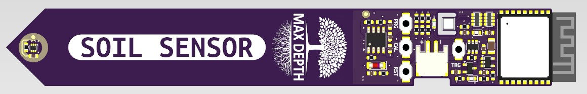
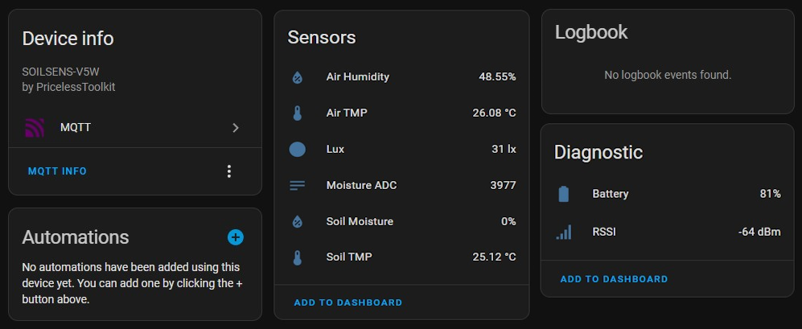
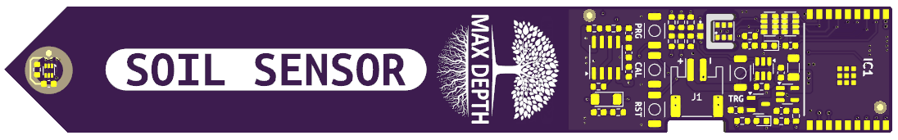
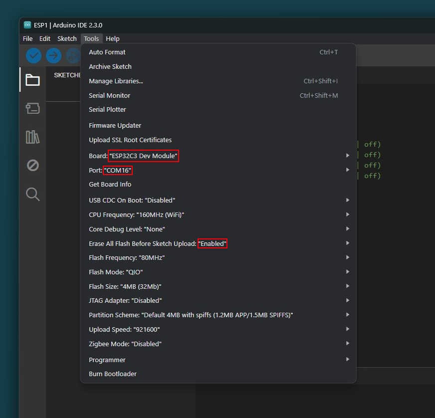

🤗 Please consider subscribing to my [YouTube channel](https://www.youtube.com/@PricelessToolkit/videos) Your subscription goes a long way in backing my work. if you feel more generous, you can buy me a coffee


[](https://ko-fi.com/U6U2QLAF8)

# Wireless "SOILSENS-V5W" and Wired ["SOILSENS-V5"](https://github.com/PricelessToolkit/SOILSENS-V5)

The SOILSENS-V5W is a reliable wireless capacitive soil moisture sensor that utilizes "ESP-NOW or Wi-Fi" for connectivity. It includes a soil temperature sensor, an air humidity and temperature sensor, and a light intensity sensor. One of its key advantages is that the capacitive sensor electrodes are embedded within the inner layer of the PCB, providing protection. It boasts very low power consumption, a compact design, long-range capabilities in ESP-NOW mode, and configuration changes can be made without the need for reflashing. Additionally, it supports MQTT Autodiscovery through CapiBridge in ESP-NOW mode or simple Wi-Fi, making it 100% compatible with Home Assistant.




## 🛒 Where to buy http://www.PricelessToolkit.com

## 📣 Updates, Bugfixes, and Breaking Changes

> [!NOTE]
>  If you're ready to contribute to the project, your support would be greatly appreciated. Due to time constraints, I may not be able to quickly verify new "features" or completely new "code" functionality, so please create a new code/script in the new folder.

- **24.07.2024** - Work in progress: "Implementing CRC for ESP-NOW."
- **22.07.2024** - Configured WiFi Hotspot.
- **21.07.2024** - Combined WiFi and ESP-NOW firmware.
- **20.07.2024** - Implemented MQTT Autodiscovery in "WiFi Mode."
- **15.06.2024** - Published battery percentage.


____________

# Initial Power On and Default Operation
- SOILSENS-V5W supports two modes: ESP-NOW and WiFi for MQTT-based connectivity.
- Upon powering on, the SOILSENS-V5W operates in ESP-NOW mode by default. This mode does not require any initial configuration and communicates directly with the Capibridge gateway. Default Key is "xy"

## 1. Configuration

To access the configuration settings, follow these steps:
1. **Initiate Configuration Mode:**
   - Press and hold the calibration button.
   - While holding the calibration button, briefly press the trigger button.
   - Continue holding the calibration button for more than 3 seconds and release it.
   - The blue LED will blink **five times**, indicating the device has entered configuration mode.

2. **Access Configuration via WiFi:**
   - After entering configuration mode, the sensor creates a WiFi Access Point (AP) named `SOILSENS-V5W`.
   - Connect to this AP using the default password: `password`.
   - Open a web browser and navigate to `http://192.168.4.1` to access the configuration page.

3. **Web Configuration:**
   - **Node Name:** Enter a unique name for your sensor.
   - **Gateway Key:** Enter the key for the Capibridge gateway.
   - **Mode:** Select the desired mode:
     - **1 (ESP-NOW):** For communication with Capibridge "Long-Range".
     - **0 (WiFi):** For standard WiFi and MQTT setup.
   - For WiFi mode:
     - **WiFi SSID:** Enter your WiFi network name.
     - **Password:** Enter the WiFi password.
     - **MAC Address:** Specify the MAC address if needed.
     - **Local IP, Gateway, Subnet:** Enter IP configuration details.
     - **MQTT Server, Port, Username, Password:** Provide MQTT broker details.

After entering the necessary information, click **Submit** to save the configuration. The sensor will restart with the new settings.

## 2. Calibrating the Soil Moisture Sensor

Accurate soil moisture readings require proper calibration. Follow these steps:
   - Put the sensor in dry soil.
   - Press and hold the calibration button.
   - While holding the calibration button, briefly press the trigger button.
   - Continue holding the calibration button for less than 2 seconds and release it.
   - The blue LED will blink twice, indicating the start of `dry soil` calibration.
   - The device will complete the calibration, indicated by three blinks.
   - Place the sensor in fully wet soil, you have 5 seconds to do so.
   - The blue LED will blink twice, indicating the start of `wet soil` calibration.
   - The device will complete the `wet soil` calibration, indicated by three blinks.


# DIY

This project is open-source, allowing you to assemble SOILSENS-V5W on your own. To simplify this process, I've provided an "Interactive HTML Boom File" located in the PCB folder. This interactive file helps you identify where to solder each component and polarity, reducing the chances of errors to a minimum. But if you don't feel confident in assembling it yourself, you can always opt to purchase a pre-assembled board from my Shop https://www.pricelesstoolkit.com

## Schematic
<details>
  <summary>View schematic. Click here</summary>

</details>

## Programming using Arduino IDE

1. - Open the provided code in the Arduino IDE.
2. - Install all neccecery libraries.
```c
      
   #include <esp_now.h>
   #include <WiFi.h>
   #include "driver/adc.h"
   #include "esp_adc_cal.h"
   #include "Wire.h"
   #include <SparkFunTMP102.h>
   #include <ArduinoJson.h>
   #include <AHT20.h>
   #include <Preferences.h>
   #include <WebServer.h>
   #include <PubSubClient.h>
           
```
  3. - Select the appropriate board and port parameters (refer to the provided screenshot for settings).
       

       
  4. - Connect 3.3V USBTTL adapter to SOILSENS-V5W

   | Sensor Pin | Adapter Pin |
   |------------|-------------|
   | TX         | RX          |
   | RX         | TX          |
   | 3V3        | 3V3         |
   | GND        | GND         |

5. - Press and hold the **PRG** button on the sensor.
6. - While holding the **PRG** button, connect the USB to TTL adapter to the USB port of your computer.
7. - Click on the **Upload** button to upload the code to the sensor.

## Troubleshooting

 - Holding the calibration button.
    -  More than 3 seconds configuration mode.
    -  Less than 3 seconds Calibration mode.
- For connectivity issues in WiFi mode, verify the WiFi SSID, password, MAC, IP, Channel, and MQTT server details.
