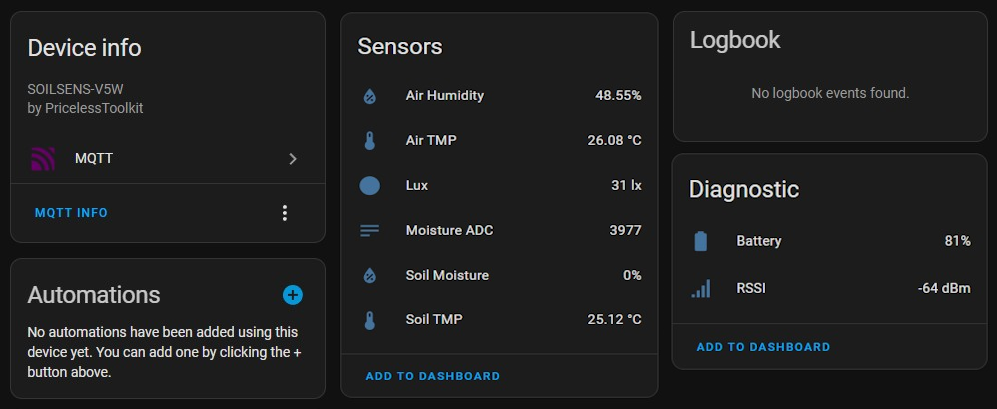
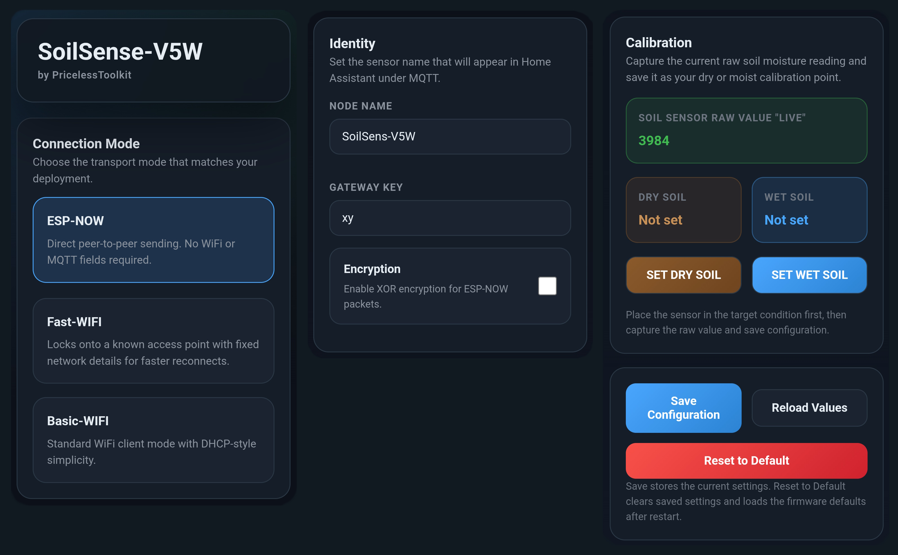
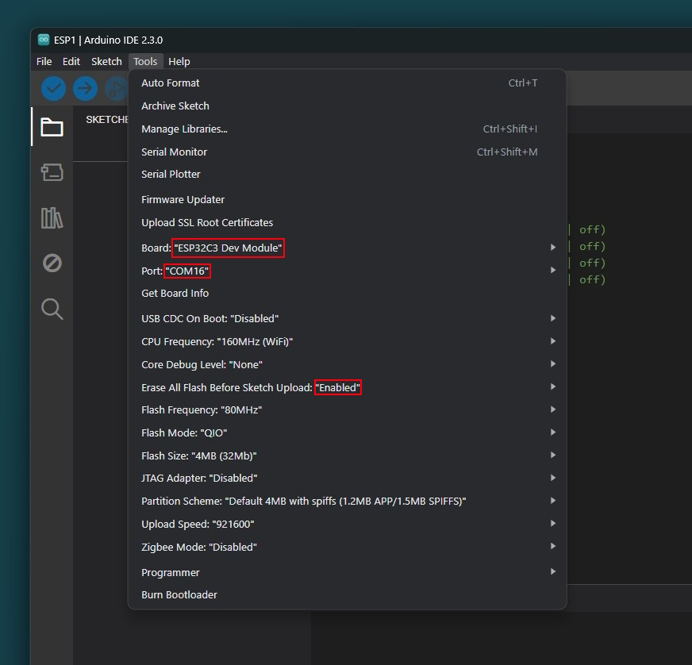
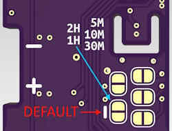
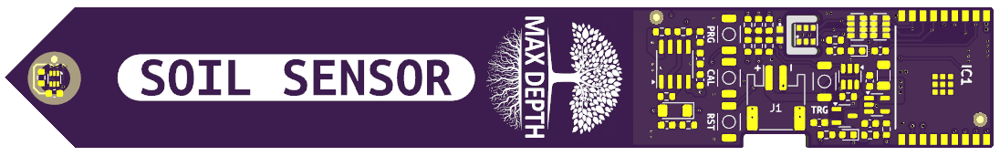
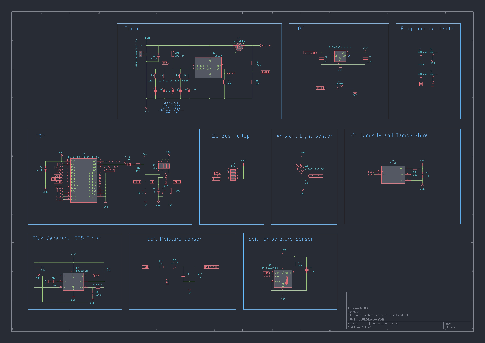
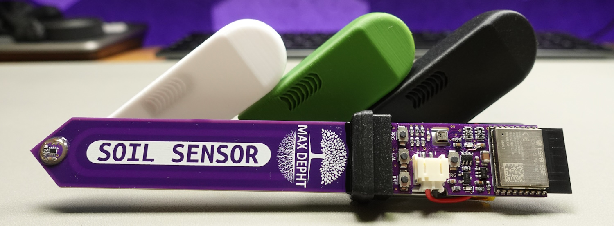

<div align="center">
  

🤗 Please consider subscribing to my YouTube channel. Your subscription goes a long way toward supporting my work. If you would like to contribute even more, you can also buy me a coffee.
  
  [Shop](https://www.pricelesstoolkit.com) | [YouTube](https://www.youtube.com/@PricelessToolkit/videos)
  
</div>
<p align="center">
  <a href="https://ko-fi.com/U6U2QLAF8">
    
  </a>
</p>


____________


# Wireless "SOILSENS-V5W" and Wired ["SOILSENS-V5"](https://github.com/PricelessToolkit/SOILSENS-V5)

The SOILSENS-V5W is a wireless capacitive soil moisture sensor that supports both `ESP-NOW` and `Wi-Fi` connectivity. It also measures soil temperature, air temperature, air humidity, and ambient light. The capacitive sensing electrodes are embedded inside the PCB, which helps protect them from direct exposure. The sensor is compact, power-efficient, and designed for long-range communication in ESP-NOW mode. It can be configured without reflashing and supports MQTT auto-discovery through CapiBridge or direct Wi-Fi MQTT integration, making it fully compatible with Home Assistant.




## 🛒 Where to Buy

https://www.PricelessToolkit.com


## 📣 Updates, Bugfixes, and Breaking Changes

- **18.04.2026** - Improved configuration portal and calibration workflow.
- - Added a cleaner configuration-only web UI with simpler setup for ESP-NOW, Fast-WIFI, and Basic-WIFI.
- - Added web-based soil calibration with live raw value preview plus dedicated Dry Soil and Wet Soil capture buttons.
- - Added Reset to Default directly inside the web interface, making recovery and reconfiguration easier.
- **12.03.2026** - Bugfix / compatibility update.
- - Fixed compilation for ESP32 Arduino Core v3.3.7 and AHT20 v1.0.2.
- - Tested with ArduinoJson v7.4.3, PubSubClient v2.8, and SparkFun TMP102 Breakout v1.1.2.
- **14.05.2025** - Added FailSafe, if it can't connect to WIFI or MQTT, it will power off after 15s.
- **21.03.2025** - Added Basic WIFI mode.


____________

## Product Specification

- **Microcontroller:**
   - ESP32-C3
- **Sensors:**
   - Soil Temperature: TMP102
   - Air Temperature and Humidity: AHT20
   - Light Sensor: ALS-PT19-315C
   - Soil Moisture: PCB Trace in the internal layer
- **Power:**
   - Uses a 1S LiPo battery with a PH2.0 connector
   - Requires an external 1S LiPo charger
- **Buttons:**
   - PRG (Programming)
   - RST (Reset)
   - CAL (Calibration)
   - TRG (Trigger)
- **LED Indicators:**
   - Green LED: Power indicator
   - Blue LED: Configuration mode indicator
- **Sensor Reading Interval:**
  - Default: 1 hour
  - Configurable: 5m, 10m, 30m, 1h, and 2h
  - Configuration Method: Adjustable via onboard PCB solder jumpers


### Required

- 1S 250mAh or less LiPo Battery (Connector PH2.0) 35x20x4mm MAX.
   - PricelessToolkit [1S 250mAh PH2.0](https://www.pricelesstoolkit.com/en/products/47-battery-li-po-37v-250mah-ph-20mm-2-pin.html)
   - https://s.click.aliexpress.com/e/_oBG0tjZ
   - https://s.click.aliexpress.com/e/_Dk14vS5
   - https://s.click.aliexpress.com/e/_DE5PfEV
   - Adafruit 150mAh https://www.adafruit.com/product/1317


> [!WARNING] 
> ⚠️ Ensure the battery connector has the correct polarity, as batteries from China sometimes come with random polarity. If it’s incorrect, you can manually swap the wires by gently lifting the plastic retainer on the pin, pulling the wire out, and then reversing the polarity before reinserting it.
> Connecting the battery with reverse polarity will damage the sensor permanently. Double-check the polarity before connecting the battery.


> [!NOTE]
> Lipo Polarity explanation "Adafruit Video" https://youtu.be/ILArrTIMFyM?si=WlTsnVo7XTozZ2FT


- 1S 4.20V LiPo charger.
  - PricelessToolkit [Micro-Charger](https://www.pricelesstoolkit.com/en/products/47-battery-li-po-37v-250mah-ph-20mm-2-pin.html)
  - Adafruit [Micro Lipo ](https://www.adafruit.com/product/1304)


> [!WARNING]  
> ⚠️ Ensure the charger’s maximum charging current does not exceed the battery’s capacity. For example, if the battery is 250mAh, the charger should have a maximum charging current of 250mA or less. Also, check the charger’s polarity, as it can sometimes be reversed.


###  In case of a Firmware update
- Aliexpress
  - [Pogo pin Clamp 6Pin 2.54mm spacing](https://s.click.aliexpress.com/e/_DEHExUb)
- PricelessToolkit
  - [Any 3.3v USB-UART Programmer](https://www.pricelesstoolkit.com/en/projects/33-uniprog-uartupdi-programmer-33v-0741049314412.html)


# Initial Power-On and Default Operation

- SOILSENS-V5W supports `ESP-NOW` and `Wi-Fi` operation.
- By default, the sensor starts in **ESP-NOW** mode.
- In this default mode, no initial setup is required if you are using a compatible [CapiBridge gateway](https://github.com/PricelessToolkit/CapiBridge).
- The default gateway key is `xy`.


| **Feature**                   | **ESP-NOW**                                                                 | **Fast-WIFI**                                      | **Basic-WIFI**            |
|-------------------------------|-----------------------------------------------------------------------------|-----------------------------------------------|-----------------------------------------------|
| **Energy Efficiency**         | Highly energy-efficient                                                     | ~3x Higher power consumption                   | ~10+x Higher power consumption     |
| **Range**                     | Long-Range                                                                  | Short range                                   | Short range                                   |
| **Configuration**             | Does not require configuration                                              | Requires network and MQTT configuration       | Requires network and MQTT configuration     |
| **Broadcasting**              | Sensor data can be read from a third device without connecting to a network | Requires connection to a network              | Requires connection to a network     |
| **Gateway Requirement**       | Requires a gateway [Capibridge](https://github.com/PricelessToolkit/CapiBridge)                                             | Does not require a gateway       | Does not require a gateway             |


## Power Consumption
> [!NOTE]
> Measured using `Power Profiler Kit 2`, with a 250 mAh battery and a 1-hour wake-up interval.

| **Parameter**                              | **ESP-NOW**               | **Fast-WIFI**               | **Basic-WIFI**            |
|--------------------------------------------|---------------------------|-----------------------------|---------------------------|
| **Active Duration (seconds)**              | 0.55 seconds              | 1.5 seconds                 | 1.5 - 10 seconds          |
| **Current During Active Phase**            | 40 mA                     | 47 mA                       | *                         |
| **Energy Consumption in Active Phase**     | 0.006112 mAh              | 0.02 mAh                    | *                         |
| **Inactive Duration**                      | 0.999847 hours            | 0.99956 hours               | *                         |
| **Energy Consumption in Inactive Phase**   | 0.00007 mAh               | 0.00007 mAh                 | *                         |
| **Total Energy Consumption**               | 0.006182 mAh              | 0.02007 mAh                 | *                         |
| **Total Hours of Operation**               | 40,445 hours              | 12,459 hours                | *                         |
| **Total Days of Operation**                | 1,685 days                | 519 days                    | *                         |

(*) Depends on the network topology


## 1. Configuration

To access the configuration settings, follow these steps:

1. **Enter Configuration Mode**
   - Press and hold the **CAL** button.
   - While holding the **CAL** button, power the sensor or brefly press **TRG** button.
   - Keep holding the **CAL** button for more than 2 seconds, then release it.
   - The blue LED will blink, indicating that the sensor has entered configuration mode, the sensor creates a WiFi Access Point named `SOILSENS-V5W`.
   - Disconnect Celular connection "4G/5G" and Connect to `SOILSENS-V5W` WIFI hotspot.
   - Open a web browser and go to `http://192.168.4.1`.





3. **Configure the Sensor in the Web UI**
   - **Connection Mode**
     - **ESP-NOW:** Uses direct ESP-NOW communication with the [CapiBridge gateway](https://github.com/PricelessToolkit/CapiBridge).
     - **Fast-WIFI:** Uses WiFi + MQTT with fixed network details for faster reconnects and lower power use than Basic-WIFI.
     - **Basic-WIFI:** Uses standard WiFi + MQTT setup with fewer required network fields.
   - **Identity**
     - **Sensor Name:** Set the name that will appear in Home Assistant under MQTT.
     - **Gateway Key:** Required only for ESP-NOW mode.
     - **ESP-NOW Encryption:** Optional. If enabled, enter the same key used by your gateway in this format: `["0x4B","0xA3","0x3F","0x9C"]`
   - **WiFi Access**
     - **WiFi SSID:** Enter your 2.4 GHz WiFi network name.
     - **Password:** Enter the WiFi password.
   - **Fast-WIFI Network Details**
     - **AP MAC Address:** Use the radio interface MAC address of your access point.
     - **WiFi Channel:** The channel must be fixed on the access point and must match the value entered here.
     - **Local IP:** Use a free IP address from your local network range and reserve it for the sensor.
     - **Gateway / Subnet:** Enter the network details that match your router.
   - **MQTT Broker**
     - Enter your MQTT server IP or hostname, port, username, and password.
     - In most Home Assistant installations, the MQTT server IP is the same as the Home Assistant IP, and the port is usually `1883`.


4. **Save or Reset**
   - Click **Save Configuration** to store the current settings and power off the sensor.
   - Click **Reload Values** to refresh the page and reload the currently saved values.
   - Click **Reset to Default** to clear all saved configuration and calibration values and return to the firmware defaults.

> [!NOTE]
> If the LED stays on after Saving configuration in WIFI mode, it means the sensor cannot connect because the SSID, Wi-Fi password, MAC address, Wi-Fi channel, or MQTT credentials are incorrect!


## 2. Calibrating the Soil Moisture Sensor

Accurate soil moisture readings require proper calibration. Follow these steps:

1. Insert the sensor into the dry soil.
2. Open the web configuration page as described in the configuration section above.
3. Go to the **Calibration** block.
4. Check **SOIL SENSOR RAW VALUE "LIVE"** and wait until the reading is stable.
5. For the dry calibration point:
   - Click **SET DRY SOIL**.
6. For the wet calibration point:
   - Water the soil to the maximum moisture level you want to allow.
   - Wait for the raw reading to settle.
   - Click **SET WET SOIL**.
7. Click **Save Configuration** to store both calibration values.

> [!NOTE]
> For the best result, avoid moving the sensor during calibration. If the soil composition changes over time, or if sediment builds up around the probe, recalibration may be needed.


> [!IMPORTANT]
> ⚠️ Until dry and wet calibration values are saved, the moisture percentage will remain at `0`.


### WiFi Signal Strength


> [!NOTE]
>  Ensure the Wi-Fi signal strength at the installation point is strong and stable.

| RSSI (dBm)      | Signal Quality | Description                                |
|-----------------|----------------|--------------------------------------------|
| -30 to -50 dBm  | Excellent      | Very strong signal, ideal for stable data transmission |
| -51 to -60 dBm  | Good           | Strong signal, generally reliable for data |
| -61 to -70 dBm  | Fair           | Moderate signal, some minor issues possible, but usable |
| -71 to -80 dBm  | Poor           | Weak signal, may experience some data drop |
| -81 to -90 dBm  | Very Poor      | Very weak signal, frequent data drop likely |
| Below -90 dBm   | Unusable       | No effective connection, likely out of range |


## Programming Using Arduino IDE

1. Open the provided code in the Arduino IDE.
2. Install all required libraries.
```c
      
   #include <esp_now.h>
   #include <WiFi.h>
   #include "driver/adc.h"
   #include "esp_adc_cal.h"
   #include "Wire.h"
   #include <SparkFunTMP102.h>
   #include <ArduinoJson.h>
   #include <AHT20.h>
   #include <Preferences.h>
   #include <WebServer.h>
   #include <PubSubClient.h>
           
```
3. Select the appropriate board and port parameters. Refer to the screenshot below for the recommended settings.
       

       
4. Connect a 3.3V USB-to-TTL adapter to SOILSENS-V5W.

   | Sensor Pin | Adapter Pin |
   |------------|-------------|
   | TX         | RX          |
   | RX         | TX          |
   | 3V3        | 3V3         |
   | GND        | GND         |

5. Press and hold the **PRG** button on the sensor.
6. While holding **PRG**, connect the USB-to-TTL adapter to your computer.
7. Click **Upload** in the Arduino IDE.


## Frequently Asked Questions
### Why is my sensor giving inconsistent readings?
Due to the capacitive sensing principle, readings can vary based on soil moisture, tightness, and insertion depth. Repeated insertions might loosen the soil, affecting subsequent readings.


## 3. Wake-Up Interval

| Solder Jumpers | Interval Selection |
|----------------|--------------------|
|  | You can change the interval by cutting the middle of the `1H` jumper and then bridging the desired jumper with solder. Available base intervals are `5m`, `10m`, `30m`, `1h`, and `2h`. Different combinations are also possible. [Parallel Resistor Calculator](https://www.digikey.fr/en/resources/conversion-calculators/conversion-calculator-parallel-and-series-resistor?utm_adgroup=Resistors&utm_source=google&utm_medium=cpc&utm_campaign=Dynamic%20Search_EN_Product&utm_term=&productid=&utm_content=Resistors&utm_id=go_cmp-9416220174_adg-92817183582_ad-676992152346_dsa-56185200348_dev-c_ext-_prd-_sig-CjwKCAjw2Je1BhAgEiwAp3KY79SzTfH1C_ZeBWNZqrVpeANAvpTVWQipCZKAlBfRqYBXxTiVhI5DOxoCsFoQAvD_BwE&gad_source=1&gclid=CjwKCAjw2Je1BhAgEiwAp3KY79SzTfH1C_ZeBWNZqrVpeANAvpTVWQipCZKAlBfRqYBXxTiVhI5DOxoCsFoQAvD_BwE) |


If you want to experiment with different wake-up intervals, you can also change the resistor value.

| Time Interval | Resistor Value (kΩ) | Time Interval | Resistor Value (kΩ) |
|---------------|------------------------|---------------|------------------------|
| 1 min         | 22.00                  | 10 min        | 57.6 - soldered        |
| 2 min         | 29.349                 | 20 min        | 77.579                 |
| 3 min         | 34.729                 | 30 min        | 93.1 - soldered        |
| 4 min         | 39.097                 | 40 min        | 104.625                |
| 5 min         | 42.2 - soldered        | 50 min        | 115.331                |
| 6 min         | 46.301                 | 1 h           | 124.00 - soldered      |
| 7 min         | 49.392                 | 1h 30min      | 149.398                |
| 8 min         | 52.224                 | 2 h           | 169.00 - soldered      |
| 9 min         | 54.902                 |

> [!NOTE]
> The default wake-up interval is 1 hour. Reducing the interval will increase energy consumption.

# DIY

This project is open-source, so you can assemble SOILSENS-V5W yourself. To make the build easier, an interactive HTML BOM file is included in the `PCB` folder. It shows component placement and polarity to reduce assembly errors. A great deal of time and money has gone into making this project open-source. Support through purchasing a ready-made device from www.PricelessToolkit.com, subscribing to the YouTube channel, or buying me a coffee helps fund future projects.

## Schematic
<details>
  <summary>View schematic. Click here</summary>

</details>


## 3D-Printed Case
The ideal case material is transparent and UV-resistant. ASA or white ABS is a good choice because it allows enough light to enter for the luminance sensor to work properly. For indoor use, translucent PETG can improve the luminance sensor range, and vent holes help the air temperature and humidity sensors work correctly. For outdoor use, a case without vent holes is recommended to reduce the risk of water ingress during heavy rain.
Glue for case https://s.click.aliexpress.com/e/_DcvGBY9




## Troubleshooting

- Holding the calibration button.
    - More than 2 seconds opens configuration mode.
- When manually pressing the trigger button, the sensor may occasionally stay on and not power off if the button is not released quickly enough. If this happens, simply press the reset button.
