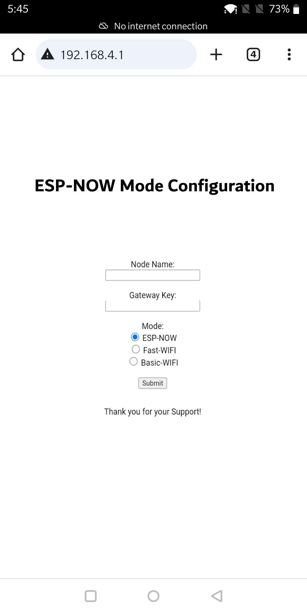
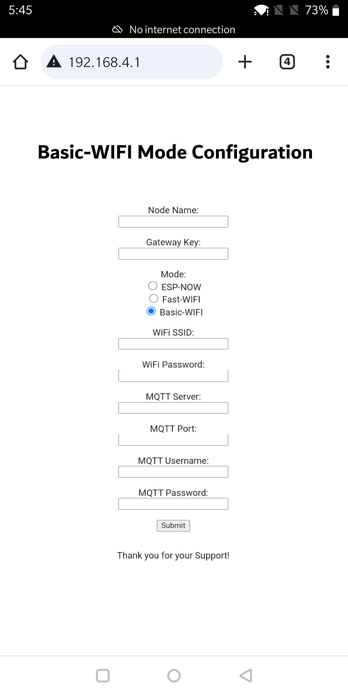
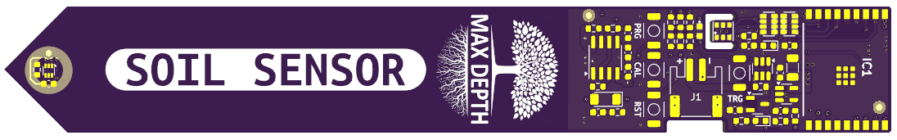

# 🚧WORK IN PROGRESS...

🤗 Please consider subscribing to my [YouTube channel](https://www.youtube.com/@PricelessToolkit/videos) Your subscription goes a long way in backing my work. if you feel more generous, you can buy me a coffee


[](https://ko-fi.com/U6U2QLAF8)

# Wireless "SOILSENS-V5W" and Wired ["SOILSENS-V5"](https://github.com/PricelessToolkit/SOILSENS-V5)

The SOILSENS-V5W is a reliable wireless capacitive soil moisture sensor that utilizes `ESP-NOW or Wi-Fi` for connectivity. It includes a soil temperature sensor, an air humidity and temperature sensor, and a light intensity sensor. One of its key advantages is that the capacitive sensor electrodes are embedded within the inner layer of the PCB, providing protection. It boasts very low power consumption, a compact design, long-range capabilities in ESP-NOW mode, and configuration changes can be made without the need for reflashing. Additionally, it supports MQTT Autodiscovery through CapiBridge in ESP-NOW mode or simple Wi-Fi, making it 100% compatible with Home Assistant.


## 🛒 Where to buy https://www.PricelessToolkit.com

## 📣 Updates, Bugfixes, and Breaking Changes

> [!NOTE]
>  If you're ready to contribute to the project, your support would be greatly appreciated. Due to time constraints, I may not be able to quickly verify new "features" or completely new "code" functionality, so please create a new code/script in the new folder.

- **24.07.2024** - Work in progress: "Implementing CRC for ESP-NOW."
- **22.07.2024** - Added the ability to configure the sensor through a Wi-Fi hotspot.
- **21.07.2024** - Combined WiFi and ESP-NOW firmware.
- **20.07.2024** - Implemented MQTT Autodiscovery in "WiFi Mode."
- **15.06.2024** - Published battery percentage.


____________

# Initial Power On and Default Operation
- SOILSENS-V5W supports two modes: `ESP-NOW` and `WiFi` for MQTT-based connectivity.
- Upon powering on, the SOILSENS-V5W operates in ESP-NOW mode by default. This mode does not require any initial configuration and communicates directly with the [Capibridge gateway](https://github.com/PricelessToolkit/CapiBridge). The default Gateway Key is "xy"


| **Feature**                   | **ESP-NOW**                                                                 | **WiFi**                                      |
|-------------------------------|-----------------------------------------------------------------------------|-----------------------------------------------|
| **Energy Efficiency**         | Highly energy-efficient                                                     | ~3x Higher power consumption                   |
| **Range**                     | Long-Range                                                                  | Short range                                   |
| **Configuration**             | Does not require configuration                                              | Requires network and MQTT configuration       |
| **Broadcasting**              | Sensor data can be read from a third device without connecting to a network | Requires connection to a network              |
| **Gateway Requirement**       | Requires a gateway [Capibridge](https://github.com/PricelessToolkit/CapiBridge)                                             | Does not require a gateway                    |


## Power consumption
> [!NOTE]
> Measured using ``Power Profiler KIT 2`` Battery Capacity 250mAh, Power Cycle 1h

| **Parameter**                       | **WIFI**               | **ESP-NOW**              |
|-------------------------------------|----------------------------|---------------------------|
| **Active Duration (seconds)**       | 1.5 seconds                | 0.55 seconds              |
| **Current During Active Phase**     | 47 mA                      | 40 mA                     |
| **Energy Consumption in Active Phase** | 0.02 mAh                  | 0.006112 mAh              |
| **Inactive Duration**       | 0.99956 hours              | 0.999847 hours            |
| **Energy Consumption in Inactive Phase** | 0.00007 mAh              | 0.00007 mAh               |
| **Total Energy Consumption**  | 0.02007 mAh                | 0.006182 mAh              |
| **Total Hours of Operation**        | 12,459 hours               | 40,445 hours              |
| **Total Days of Operation**         | 519 days                   | 1,685 days                |


## Product Specification

- **Microcontroller:**
   - ESP32-C3
- **Sensors:**
   - Soil Temperature: TMP102
   - Air Temperature and Humidity: AHT20
   - Light Sensor: ALS-PT19-315C
   - Soil Moisture: PCB Trace in the internal layer
- **Power:**
   - Uses 1S LiPo Battery "Connector PH2.0"
   - Requires external 1S LiPo charger
- **Buttons:**
   - PRG (Programming)
   - RST (Reset)
   - CAL (Calibration)
   - TRG (Trigger)
- **LED Indicators:**
   - Green LED: Indicates the power-on state
   - Blue LED: Indicates calibration/configuration mode
- **Sensor Reading Interval:**
  - Default: 1 hour
  - Configurable: 5m, 10m, 30m, 1h, and 2h
  - Configuration Method: Adjustable via onboard PCB solder jumpers


## 1. Configuration

To access the configuration settings, follow these steps:
1. **Initiate Configuration Mode:**
   - Press and hold the calibration button.
   - While holding the calibration button, briefly press the trigger button.
   - Continue holding the calibration button for more than 3 seconds and release it.
   - The blue LED will blink **five times**, indicating the device has entered configuration mode.

2. **Access Configuration via WiFi:**
   - After entering configuration mode, the sensor creates a WiFi Access Point (AP) named `SOILSENS-V5W`.
   - Connect to this AP using the default password: `password`.
   - Open a web browser and navigate to `http://192.168.4.1` to access the configuration page.


| Mode ESP-NOW | Mode Wi-Fi |
|--------------|------------|
| Default Node name and key. | Only the key is not required. |
|  |  |


3. **Web Configuration:**
   - **Node Name:** Enter a unique name for your sensor.
   - **Gateway Key:** Enter the key for the [Capibridge gateway.](https://github.com/PricelessToolkit/CapiBridge) for WIFI Mode not required
   - **Mode:** Select the desired mode:
     - **1 (ESP-NOW):** Selects ESP-NOW Protocol "Long-Range".
     - **0 (WiFi):** Selects standard WiFi and MQTT setup.
   - For WiFi mode:
     - **WiFi SSID:** Enter your WiFi network name.
     - **Password:** Enter the WiFi password.
     - **MAC Address:** Specify the Access point MAC address "9b:84:5a.....".
     - **Local IP, Gateway, Subnet:** Enter IP address ⚠️ "IP Address outside of DHCP Range".
     - **MQTT Server, Port, Username, Password:** Provide MQTT broker details.

After entering the necessary information, click **Submit** to save the configuration. The sensor will restart with the new settings.


> [!IMPORTANT]
> ⚠️ Entering to configuration mode will erase all current settings. Therefore, if you enter configuration mode without saving any changes, all settings will revert to their factory defaults, such as `ESP-NOW` with Key `xy`.


## 2. Calibrating the Soil Moisture Sensor

Accurate soil moisture readings require proper calibration. Follow these steps:
   - Put the sensor in dry soil.
   - Press and hold the calibration button.
   - While holding the calibration button, briefly press the trigger button.
   - Continue holding the calibration button for less than 2 seconds and release it.
   - The blue LED will blink twice, indicating the start of `dry soil` calibration.
   - The device will complete the calibration, indicated by three blinks.
   - Place the sensor in fully wet soil, you have 5 seconds to do so.
   - The blue LED will blink twice, indicating the start of `wet soil` calibration.
   - The device will complete the `wet soil` calibration, indicated by three blinks.


> [!IMPORTANT]
>  ⚠️ Until the soil moisture sensor calibration is not performed, the sensor reading will be 0.


## 3. Wake Up Interval

| Solder Jumpers | interval selection |
|--------------|------------|
|  |  You can change it by cutting the middle of the 1H Jumper. Then bridge the other jumper with the solder. Available intervals are 5m, 10m, 30m, 1h, and 2h, plus every combination is possible. [Parallel Resistor Calculator](https://www.digikey.fr/en/resources/conversion-calculators/conversion-calculator-parallel-and-series-resistor?utm_adgroup=Resistors&utm_source=google&utm_medium=cpc&utm_campaign=Dynamic%20Search_EN_Product&utm_term=&productid=&utm_content=Resistors&utm_id=go_cmp-9416220174_adg-92817183582_ad-676992152346_dsa-56185200348_dev-c_ext-_prd-_sig-CjwKCAjw2Je1BhAgEiwAp3KY79SzTfH1C_ZeBWNZqrVpeANAvpTVWQipCZKAlBfRqYBXxTiVhI5DOxoCsFoQAvD_BwE&gad_source=1&gclid=CjwKCAjw2Je1BhAgEiwAp3KY79SzTfH1C_ZeBWNZqrVpeANAvpTVWQipCZKAlBfRqYBXxTiVhI5DOxoCsFoQAvD_BwE) |


But if you are bored and want to play with different intervals you can change the resistor value.

| Time Interval | Resistor Value (kΩ) | Time Interval | Resistor Value (kΩ) |
|---------------|------------------------|---------------|------------------------|
| 1 min         | 22.00                  | 10 min        | 57.6 - soldered        |
| 2 min         | 29.349                 | 20 min        | 77.579                 |
| 3 min         | 34.729                 | 30 min        | 93.1 - soldered        |
| 4 min         | 39.097                 | 40 min        | 104.625                |
| 5 min         | 42.2 - soldered        | 50 min        | 115.331                |
| 6 min         | 46.301                 | 1 h           | 124.00 - soldered      |
| 7 min         | 49.392                 | 1h 30min      | 149.398                |
| 8 min         | 52.224                 | 2 h           | 169.00 - soldered      |
| 9 min         | 54.902                 |

> [!NOTE]
> Default time interval is 1 Hour. Reducing the time interval will result in increased energy consumption.

# DIY

This project is open-source, enabling you to assemble SOILSENS-V5W yourself. To make this easier, I've included an 'Interactive HTML BOM File' in the PCB folder, which guides you on where to solder each component and indicates polarity, minimizing the chance of errors. I've invested a lot of time and money into making this project open-source. Your support, whether through buying a ready-made device from my shop www.PricelessToolkit.com subscribing to my YouTube channel, or buying me a coffee, is greatly appreciated and helps fund future projects.

## Schematic
<details>
  <summary>View schematic. Click here</summary>

</details>

## Programming using Arduino IDE

1. - Open the provided code in the Arduino IDE.
2. - Install all neccecery libraries.
```c
      
   #include <esp_now.h>
   #include <WiFi.h>
   #include "driver/adc.h"
   #include "esp_adc_cal.h"
   #include "Wire.h"
   #include <SparkFunTMP102.h>
   #include <ArduinoJson.h>
   #include <AHT20.h>
   #include <Preferences.h>
   #include <WebServer.h>
   #include <PubSubClient.h>
           
```
  3. - Select the appropriate board and port parameters (refer to the provided screenshot for settings).
       

       
  4. - Connect 3.3V USBTTL adapter to SOILSENS-V5W

   | Sensor Pin | Adapter Pin |
   |------------|-------------|
   | TX         | RX          |
   | RX         | TX          |
   | 3V3        | 3V3         |
   | GND        | GND         |

5. - Press and hold the **PRG** button on the sensor.
6. - While holding the **PRG** button, connect the USB to TTL adapter to the USB port of your computer.
7. - Click on the **Upload** button to upload the code to the sensor.


## 3D-Printed Case
The ideal material for the case is transparent and UV-resistant. ASA "UV-resistant" or ABS in white is the best choice as it allows light to enter, enabling the luminance sensor to function properly. For indoor use, consider translucent PETG to increase the luminance sensor's range and opt for a 3D-printed case with vent holes to ensure proper function of the air humidity and temperature sensors. For outdoor use, a case without vent holes is recommended to prevent water ingress during heavy! rain. 


## Troubleshooting

 - Holding the calibration button.
    -  More than 3 seconds configuration mode.
    -  Less than 3 seconds Calibration mode.
- For connectivity issues in WiFi mode, verify the WiFi SSID, password, MAC, IP, Channel, and MQTT server details.
